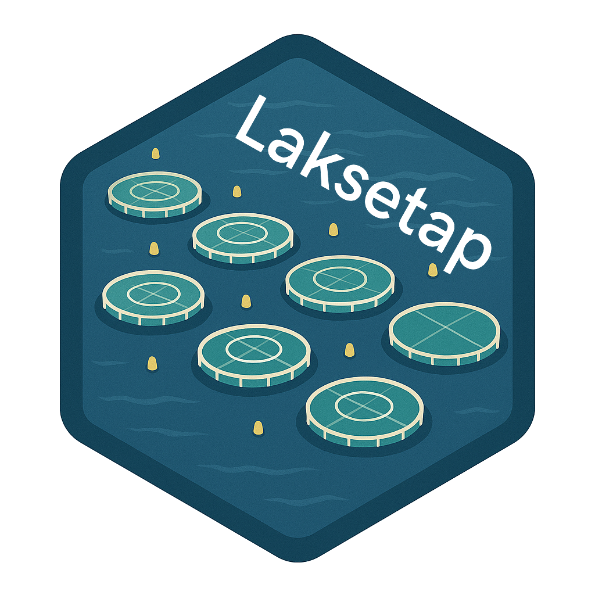

<!-- README.md is generated from README.Rmd. Please edit that file -->

# Laksetap

<!-- badges: start -->

<!-- badges: end -->

Laksetap is a R Golem Shiny App for reporting salmon and rainbow trout
losses in Norway.

It is published at
[apps.vetinst.no/laksetap](https://apps.vetinst.no/laksetap).

## Running the app locally

The app runs with dummy data locally without the need to be connected to
VI’s server. The dummy data is distributed as part of the package in
[inst/extdata](inst/extdata). For anyone interested in implementing the
app with their own data, running the app from
[dev/run_dev.R](dev/run_dev.R) will load the app with the dummy data.
The `dev` folder also contains definitions of the data sets and scripts
to test the visualization functions with the dummy data.

## Assumptions and behaviour regarding what is displayed

Since the app is built for reporting fish mortality in Norway, it
assumes that the species displayed are salmon and rainbow trout.
However, the available data for these species may differ in terms of
aggregation levels. Additionally, Norway’s geographical areas for
displaying this data are also assumed: production area as
“Produksjonsområde”, county as “Fylke”, and country.

Because of this, the app has choices (adjustable in the config) for
`species` and `geo_group` in `mod_top_bar.R` and we have implemented a
logic about adjusting the UI when switching between them. This could be
improved, or generalized so any species can be displayed in the app, but
for the time being this remains as like so.

The code that produces the dummy data also follows this assumption and
does not generate data for other geographical levels than country for
rainbow trout.

All of the other inputs are read from the data, such as number of year,
areas for which data are available, etc.

## Configuration and translation of the app

The app can be configured and translated to different languages. Files
managing this are passed as `golem options` in `run_app.R`.

The [inst/app/www/config.json](inst/app/www/config.json) contains paths
to images, favicons, social media previews, and similar. Additional
configuration that lives within the code is the tracking script in
`tag_manager` in `fct_meta.R`. This needs to be removed, or adjusted if
you are using the app with your data.

All labels used in the app are in
[inst/app/www/labels_nb_no.json](inst/app/www/labels_nb_no.json). An
English translation of the `.json` is also provided. The long form text
(i.e. more than a few words) is in separate `.md` files
[inst/app/www/](inst/app/www/).

The code in `fct_data.R` also contains a bit of locale specific code,
like for example labeling of data for
`"dead", "discarded", "escaped", "other"` to
`"Døde", "Utkast", "Rømt", "Annet"`. This could easily be overlooked,
but the idea here is to be able to use the data functions both in the
app, and in an interactive R session. One should be aware of this when
working with the data and app.

## Mortality calculator

We provide a mortality calculator in R and Excel as part of the
repository, and downloadable from the app. The calculator itself is not
part of the app UI because we don’t want to handle company or farm level
data in the app and potentially run into legal or security issues. The
calculator uses the same approach to calculate fish mortality as used in
Norwegian Veterinary Institute’s Fish Health Report.

## Docker

Running the app with docker *should* work:

    docker build -f Dockerfile_base --progress=plain -t laksetap_base .
    docker build -f Dockerfile --progress=plain -t laksetap:latest .
    docker run -p 80:80 laksetap:latest
    # then go to 127.0.0.1:80

## Citation

To cite package ‘laksetap’ in publications use:

Nakov N, Silva De Oliveira V (2025). *laksetap: A Shiny app for
reporting salmon and rainbow trout losses in Norway*. R package version
1.0.3, <https://github.com/NorwegianVeterinaryInstitute/laksetap>.

A BibTeX entry for LaTeX users is

      @Manual{,
        title = {laksetap: A Shiny app for reporting salmon and rainbow trout losses in
    Norway},
        author = {Novica Nakov and Victor Henrique {Silva De Oliveira}},
        year = {2025},
        note = {R package version 1.0.3},
        url = {https://github.com/NorwegianVeterinaryInstitute/laksetap},
      }
