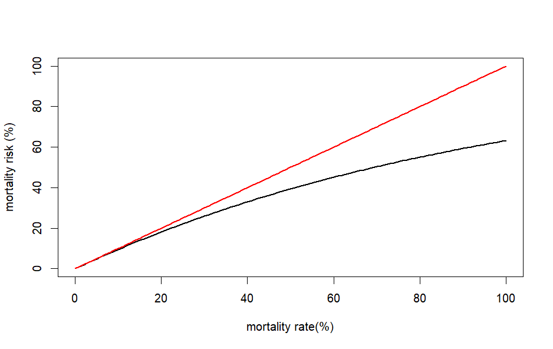

# Background
This document describes the mathematical formulas used in the Laksetap app to calculate mortality, including monthly mortality, yearly cumulative mortality, and cumulative mortality over production cycles. All measures are expressed as mortality risk. Data preprocessing procedures are not included.

# Data
The following data is used as input for the different calculations:

- ***site_nr*** (string). ID for a sea site, given as a five-digit code.
- ***species*** (string). The two species of interest: "Laks" (Atlantic salmon) and "Regnbueørret" (rainbow trout).
- ***date*** (Date, YYYY-MM-DD). Observation date with monthly resolution.
- ***dead*** (integer). Number of dead fish per site and month. Let $M_{it}$ denote the number of dead fish for sea site $i$ in month $t$.
- ***at_risk*** (numeric). Number of fish at risk of dying during a month, defined as the average number of fish present over the month. Let $N_{it}$ be the number of fish at the start of month $t$ for sea site $i$, and let $N_{i(t+1)}$ be the number at the start of the following month. The number of fish at risk is defined as:
  
  $$
  \overline{N}_{it} = \frac{N_{it} + N_{i(t+1)}}{2},
  $$
  
  i.e., the average number of fish at the start and end of the month.  
  *Note:* $N_{i(t+1)}$ does not necessarily equal $N_{it} - M_{it}$, since fish may leave the sea site for reasons other than death (e.g. escape, discarded, or other causes).
  
- ***area*** (categorical): Production area (PA) with 12 levels ("Norway", "PA1-2", "PA3", "PA4", "PA5", "PA6", "PA7", "PA8", "PA9", "PA10", "PA11", and "PA12-13"), depending on data availability and minimum reporting thresholds.
- ***county*** (categorical): County with 8 levels ("Norway", "Agder", "Møre og Romsdal", "Trøndelag", "Nordland", "Troms", "Rogaland", "Vestland"), depending on data availability and minimum reporting thresholds.
- ***months_at_sea*** (integer): Number of months the production cycle has been at sea. The first month is coded as "1", the second as "2", and so on. The month of slaughter is coded as "0".

# Formulas

## Mortality rate
The mortality rate, $\Delta M_{it}$, for ***site_nr*** $i$ in month $t$, is defined as the proportion of dead fish relative to the number of fish at risk, i.e.:

$$
\Delta M_{it} = \frac{M_{it}}{\overline{N}_{it}} \hspace{10mm} (1)
$$

## Mortality risk
Furthermore, the mortality risk, $R_{it}$, for ***site_nr*** $i$ in month $t$, is defined as:

$$
R_{it} = 1 - e^{-\Delta M_{it}} \hspace{10mm} (2)
$$

The mortality rate and mortality risk are closely connected. The mortality risk is a strictly increasing function of the mortality rate. For small values, the mortality rate and mortality risk are approximately equal. As the mortality rate increases, the difference between the mortality rate and the mortality risk also increases.

**Note:** The mortality rate $\Delta M_{it}$ is not a probability and may exceed 1 (100%) in some cases. This can occur because the number of fish at risk is defined as an average over the month, and fish may both leave the population for reasons other than death and be added during the month (e.g., due to multiple stockings).

The mortality risk $R_{it}$, on the other hand, is bounded between 0 and 1 and can be interpreted as the probability of death during the month. As the mortality rate increases, the difference between the mortality rate and the mortality risk becomes more pronounced (see figure below).

## Cumulative mortality risk
An important point is that the total (cumulative) risk over several months, from month $t$ to month $t+n$, denoted $R^{\mathrm{tot}}_{i,t,t+n}$ for ***site_nr*** $i$, can be calculated as follows (see Bang Jensen, Qviller \& Toft, 2020):

$$
R^{\mathrm{tot}}_{i,t,t+n} = 1 - \prod_{k = t}^{t+n}(1 - R_{ik}) = 1 - e^{-\sum_{k = t}^{t+n} \Delta M_{ik}} \hspace{10mm} (3)
$$

which is an equivalent way of expressing that the survival probabilities $(1 - \text{risk})$ can be multiplied.

# Monthly mortality

Let $\mathit{S}$ denote a subset of sea sites representing a geographical aggregation level. The level may be a county or a combination of counties, a production area or a combination of production areas, or the national level. For subset $\mathit{S}$, the following quantities are calculated:

- $n_{St}$: The number of active sea sites, i.e., sites with registrations of both dead fish and fish ***at risk*** in month $t$.
- $M_{it}$ and $R_{it}$ are calculated for all sea sites in subset $S$, i.e., for $i = 1, \dots, n_{St}$, based on Equations (1) and (2). Only results based on mortality risk (i.e., $R_{it}$) are reported in Laksetap.
- $\xi^{R_{St}}_{25}$, $\xi^{R_{St}}_{50}$, and $\xi^{R_{St}}_{75}$, i.e., the 25th, 50th (median), and 75th percentiles of the mortality risk within subset $S$, are calculated and reported in Laksetap.

**Note:** The percentiles $\xi^{R_{St}}_{25}$ and $\xi^{R_{St}}_{75}$ represent the variation in mortality risk between sea sites. These percentiles are not systematically affected by the number of sites ($n_{St}$).

# Yearly cumulative mortality

## Subset of sea sites

Let $\mathit{S}_y$ denote the subset of sea sites within a given geographical aggregation level that have valid registrations for at least one month within year $y$. The yearly cumulative mortality is calculated and reported as follows:

- ***Step 1***: Calculate monthly mortality rates $\Delta M_{it}$ for all sea sites $i \in \mathit{S}_y$ and for all months with valid data, according to Equation (1).

- ***Step 2***: Let $n_{\mathit{S}_{yt}}$ be the number of sea sites in $\mathit{S}_y$ with valid data in month $t$, where $t \in y$. The mean mortality rate in month $t$ is calculated as:

$$
\overline{\Delta M}_{\mathit{S}_{yt}} = \frac{1}{n_{\mathit{S}_{yt}}} \sum_{i \in \mathit{S}_{yt}} \Delta M_{it} \hspace{10mm} (4)
$$

- ***Step 3***: The mean yearly cumulative mortality risk up to month $t = 1, \ldots, 12$ is calculated as:

$$
R^{\mathrm{tot}}_{\mathit{S},t} = 1 - e^{-\sum_{k = 1}^{t} \overline{\Delta M}_{\mathit{S}_{yk}}} \hspace{10mm} (5)
$$

- ***Step 4***: The mean yearly cumulative mortality risk for all months (January to December), across the different geographical aggregation levels, is reported in the Laksetap app.

# Production cycle cumulative mortality

## Valid production cycles

The first step is to identify valid production cycles. The following criteria are used:

- The production cycle has to be registered as slaughtered (the last month has registration "0" for variable ***months_at_sea***).
- The production cycle has to have valid registrations for ***at_risk*** and ***dead*** for all months in the cycle, with no missing data. The observations must cover a continuous sequence of months (i.e., no gaps in time).
- The production cycle has to have been at sea for a minimum of 8 months and a maximum of 24 months.

## Subsets of production cycles

Let $\mathit{S}_y$ denote a subset of valid production cycles that are slaughtered within a given year ($y$) and within a defined geographical aggregation level (PA, county, or the whole country). For each such subset, the following quantities are calculated:

- $n_{\mathit{S}_y}$: The total number of production cycles ending in year $y$.

- The cumulative mortality risk for each production cycle, $R^{\mathrm{tot}}_{i,t_{i1},\,t_{i1}+n_i-1}$, calculated using Equation (3). Here, $t_{i1}$ denotes the first month at sea for production cycle $i$, and $n_i$ denotes the total number of months the production cycle is at sea. Both the start month ($t_{i1}$) and the duration ($n_i$) may vary across production cycles. The end month, $t_{i1}+n_i-1$, must fall within year $y$, ensuring that production cycles are grouped by their slaughter year.

- In Laksetap, $\xi^{25}_{R^{\mathrm{tot}}_{\mathit{S}_y}}$, $\xi^{50}_{R^{\mathrm{tot}}_{\mathit{S}_y}}$, and $\xi^{75}_{R^{\mathrm{tot}}_{\mathit{S}_y}}$, i.e., the 25th, 50th (median), and 75th percentiles of the cumulative mortality risk within subset $\mathit{S}_y$, are reported.

# References

Bang Jensen, B., Qviller, L., og Toft, N. (2020). *Spatio-temporal variations in mortality during the seawater production phase of Atlantic salmon (Salmo salar) in Norway*. Journal of Fish Diseases, 43, 445–457.

Toft, N., Agger, J. F., Houe, H., og Bruun, J. (2004). Measures of disease frequency. I H. Houe, A. K. Ersbøll, and N. Toft (Red.), *Introduction to Veterinary Epidemiology* (pp. 77–93). Frederiksberg, Denmark: Biofolia.